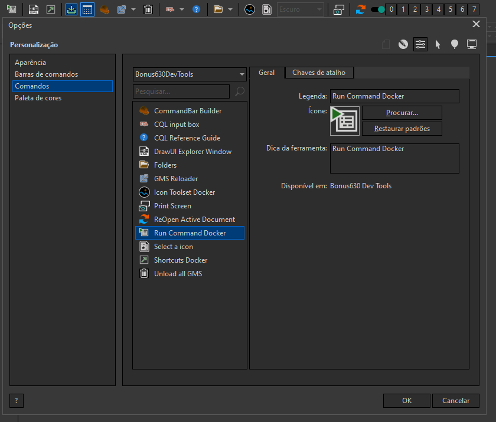
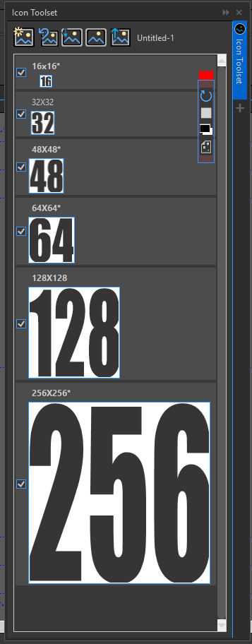

# Bonus630DevToolsBar!

This repository provides you with a comprehensive codebase for creating an addon for CorelDRAW. The solution, built using Visual Studio, compiles into a powerful addon that incorporates a set of tools to enhance your CorelDRAW experience.

Whether you're an experienced developer or just starting with CorelDRAW addons, this toolkit offers a solid foundation to streamline your workflow and expand the capabilities of the software. With a range of meticulously crafted tools, you'll be equipped to develop innovative addons that boost productivity and unleash your creativity.

## Tools Set:

1.: RunCommandDocker

The RunCommandDocker tool is a Docker-based alternative to the native VSTA editor in CorelDRAW. While the native CorelDRAW editor only allows you to create macros using C#, this tool expands your options by enabling macro creation in VB as well. With this tool, you have the flexibility to use any editor of your choice, freeing you from being limited to a specific version of Visual Studio required by CorelDRAW. You can even edit macros using a simple text editor like Notepad, thanks to the built-in C# and VB project templates. Additionally, the tool incorporates the MSBuild command to compile your DLL, simplifying the development process.

Key Features:

* Docker-based alternative to the CorelDRAW VSTA editor.
* Support for macro creation in both C# and VB languages.
* Ability to import native CorelDraw VSTA macros in CGSAddon format
* Flexibility to use any editor, including basic text editors like Notepad.
* Built-in C# and VB project templates for quick start.
* Integration of MSBuild command for easy DLL compilation.
* Customizable folder for DLL storage.
* Ability to create macros with parameters and return values.
* Compatibility for using a macro with return value as a parameter for another macro.
* Simple object inspector for exploring methods and properties of .NET and VGCore objects.
* Jobs run in the background
* Shaperange Manager
* Pin the most useds commands
* Console and throw returns

The RunCommandDocker tool offers an enhanced development experience for CorelDRAW macros. It allows you to work with both C# and VB languages, use your preferred editor, and compile your macros into DLLs using the MSBuild command. You can specify a specific folder to store the DLLs and take advantage of macros with parameters and return values, as well as leverage macros as parameters in other macros.

2.: DrawUIExplorer

The DrawUIExplorer tool provides an intuitive interface for opening and exploring the drawui.xml file of CorelDRAW or a workspace file in a tree-like structure. This tool comes with a powerful search system, branching capabilities, XSLT testing, icon extraction, item highlighting, opening dockers and dialogs, and running data sources. It serves as an assistant in creating your AppUI and UserUI files.

Key Features:

* Open and explore drawui.xml and workspace files.
* Tree-like structure for easy navigation.
* Comprehensive search functionality.
* Branching capabilities for organizing and managing elements.
* XSLT testing to validate transformations.
* Icon extraction feature for extracting icons from the file.
* Item highlighting for improved visibility.
* Open dockers, dialogs and invoke items directly from the tool.
* Run data sources for testing and verification.

The DrawUIExplorer tool simplifies the process of working with drawui.xml and workspace files in CorelDRAW. It allows you to navigate and search through the file structure effortlessly, organize elements with branching, and validate XSLT transformations. You can extract icons, highlight specific items for better visibility, and directly access dockers and dialogs from within the tool. Additionally, you can run data sources to test and verify their functionality.

Utilize the core functionality of the DrawUIExplorer tool to perform searches within your projects, enabling efficient navigation and locating specific elements. This feature further enhances your productivity and streamlines the development process.

3.: Shortcuts Docker

The Shortcuts Docker is a powerful tool that generates a comprehensive list of shortcuts present in the DrawUI.xml file. It utilizes the core functionality of the DrawUIExplorer tool to provide an intuitive interface for viewing and managing shortcuts. In addition to visualizing the shortcuts, this docker allows you to execute commands directly from within the tool.

Key Features:

* Generate a list of shortcuts from the DrawUI.xml file.
* Utilizes the core functionality of the DrawUIExplorer tool.
* Intuitive interface for easy navigation and management.
* View shortcuts in a user-friendly format.
* Execute commands directly from the docker.

4.: GMS Dragger

The GMS Dragger is a powerful utility designed to simplify the process of managing and organizing GMS (CorelDRAW script) files. With this tool, you can conveniently drag and drop your GMS files onto the tool's icon or click to select them. The tool provides several useful functionalities to enhance your GMS management experience.

Key Features:

* Drag-and-drop functionality for easy GMS file handling.
* Copy GMS files to the CorelDRAW GMS folder for seamless integration.
* Automatically load the copied GMS files into CorelDRAW.
* Remove the DPB code from the loaded GMS files.
* Quick access to unload all GMS files and remove them from the CorelDRAW GMS folder.

The GMS Dragger tool simplifies the process of adding GMS files to CorelDRAW. By dragging and dropping your GMS files onto the tool's icon or clicking to select them, you can easily copy the files to the CorelDRAW GMS folder. The copied GMS files will be automatically loaded into CorelDRAW, ensuring seamless integration with the software. Additionally, the tool removes the DPB (DataPump Binary) code from the loaded GMS files, optimizing their performance and compatibility.

The GMS Dragger also provides a convenient option to unload all the loaded GMS files from CorelDRAW and remove them from the CorelDRAW GMS folder. This feature allows for quick cleanup and organization of your GMS files.

To use the GMS Dragger, simply drag and drop your GMS files onto the tool's icon or click to select them. The tool will handle the copying, loading, and removal processes automatically. Refer to the documentation provided in this repository for detailed instructions on installation, usage guidelines, and examples.

5.: CommandBar Builder

The CommandBar Builder is a robust utility crafted to streamline the creation of command bars for CorelDRAW. This tool excels at generating command bars complete with shortcuts for your macros. Leveraging CorelDRAW's addon system, it executes macros without the need for them to be loaded into CorelDRAW, ensuring optimal performance. Additionally, it extends its functionality to create bars for various commands beyond macros.

Key Features:

* Macro Shortcut Integration:
Create command bars with shortcuts for your macros, enhancing efficiency in CorelDRAW.

* Addon System Utilization:
Harness CorelDRAW's addon system to execute macros seamlessly without loading them into CorelDRAW, preventing any impact on software speed.

* Custom Command Bars:
Design command bars not only for macros but also for other commands, providing versatility in your CorelDRAW workflow.

* Project Save and Load:
Enjoy the convenience of saving and loading your command bar projects, ensuring easy retrieval and sharing of customized setups.

* Icon and Shortcut Integration:
Load icons and shortcuts for commands, simplifying the distribution and reinstallation of personalized shortcuts for macros and other functionalities.

The CommandBar Builder tool streamlines the creation of command bars for CorelDRAW, offering a dynamic solution for macro integration and command execution. By utilizing the addon system, this tool ensures optimal software performance by executing macros without loading them into CorelDRAW. Its versatility extends to creating command bars for various commands, providing a comprehensive solution for your workflow.

This tool also allows you to save and load your command bar projects, ensuring that your customized setups can be easily retrieved and shared. The integration of icons and shortcuts further facilitates the distribution and reinstallations of personalized shortcuts for macros and other commands.

To use the CommandBar Builder, follow the intuitive interface to design your command bars with ease.

6.: GMS Reloader

The GMS Reloader serves as an indispensable popup tool designed to efficiently manage the loading and unloading of macros in your CorelDRAW application from the GMS folder in AppData. This tool is specifically crafted to prevent any overload on your CorelDRAW environment.

Key Features:

* Popup Accessibility:
The GMS Reloader is conveniently accessible as a popup, ensuring quick and easy access to its functionalities.

* Load and Unload Macros:
Seamlessly load and unload macros from your CorelDRAW application, streamlining the management of GMS files in the AppData folder.

* Prevention of CorelDRAW Overload:
With its focused purpose, the GMS Reloader prevents any potential overload on your CorelDRAW software, enhancing its performance.

* AppData Folder Integration:
The tool operates specifically on the GMS files present in the AppData folder, providing a targeted approach to macro management.

The GMS Reloader's popup interface offers a user-friendly experience, allowing users to effortlessly load and unload macros from their CorelDRAW application. By focusing on the GMS files in the AppData folder, it ensures a precise and effective approach to preventing any undue strain on CorelDRAW.

To utilize the GMS Reloader, simply access the popup interface and utilize its intuitive controls for loading and unloading macros as needed. Refer to the accompanying documentation for detailed instructions on installation, usage guidelines, and examples, ensuring a smooth integration into your CorelDRAW workflow.

7.: CQLEvaluator

The CQLEvaluator is a valuable tool that allows you to validate your expressions written in CQL (Corel Query Language). With this tool, you can easily verify the correctness and accuracy of your CQL expressions, ensuring they meet your intended criteria.

Key Features:

* Expression validation for CQL (Corel Query Language).
* Easy input of CQL expressions for evaluation.
* Quick feedback on the validity of the expressions.

The CQLEvaluator simplifies the process of validating CQL expressions, enabling you to catch errors or identify incorrect usage early on. By inputting your CQL expressions into the tool, you can promptly receive feedback on their validity. The tool identifies syntax errors or incorrect usage, helping you refine your expressions and ensure they accurately reflect your intended criteria.

To use the CQLEvaluator, simply input your CQL expressions into the tool and initiate the evaluation process. The tool will swiftly analyze the expressions and provide feedback on their validity. Refer to the documentation provided in this repository for detailed instructions on installation, usage guidelines, and examples.

8.: Folders

The Folders tool, presented in a convenient popup format, offers a practical solution for organizing and accessing frequently used folders in CorelDRAW. With the ability to pin shortcuts to specific folders and assign custom icons, this tool enhances accessibility to your most-used directories.

Key Features:

* Folder Shortcuts:
Pin shortcuts to designated folders,websites,programs or files, creating a quick and easy-to-access menu for your frequently used directories.

* Custom Icons:
Personalize your folder, websites, programs or files, shortcuts by assigning custom icons, adding a visually appealing and intuitive element to your organizational system.

* Enhanced Accessibility:
Streamline your workflow by having instant access to your most-used folders directly from the popup interface.

The Folders tool simplifies the process of navigating through your file system within CorelDRAW by allowing you to fix shortcuts to specific folders. The addition of custom icons adds a visual touch, making it easier to identify and access your preferred directories.

To set up the Folders tool, simply open the popup interface, pin your desired folder shortcuts, and assign custom icons as needed. This tool provides a user-friendly solution for managing and accessing your frequently used folders, contributing to an organized and efficient workflow. Detailed instructions on installation, usage guidelines, and examples can be found in the accompanying documentation.

9.: Icon Toolset Docker

The Icon Toolset is a comprehensive suite of tools designed to facilitate the creation of icons within CorelDRAW. This toolset addresses the limitations of the native CorelDRAW icon creation system, which lacks the ability to store multiple sizes of images. The Icon Toolset not only overcomes this limitation but also includes features to prepare the document with pages of specific sizes for each internal resolution of the icon. Additionally, it provides various commands to assist in image creation, along with a quick-loading button for efficient previewing of icons in the CorelDRAW command bars.

Key Features:

* Multiple Image Size Support:
Overcome the native CorelDRAW limitation by enabling the storage of multiple sizes of images for icons.

* Page Size Configuration:
Prepare the document with pages of specific sizes corresponding to each internal resolution of the icon, streamlining the icon creation process.

* Image Creation Commands:
Access a range of small commands within the toolset to aid in the creation of icon images, enhancing efficiency and precision.

* Quick Load Button:
Load icons rapidly for swift previewing, allowing for a quick visual assessment of the final appearance in CorelDRAW command bars.

The Icon Toolset provides an all-encompassing solution for icon creation within CorelDRAW, ensuring flexibility in image size storage and efficient document preparation. The inclusion of small commands further facilitates the creation process, while the quick load button enables a rapid preview of icons directly within the CorelDRAW interface.

To utilize the Icon Toolset, explore the intuitive interface and take advantage of its various features for creating and previewing icons. Detailed instructions on installation, usage guidelines, and examples can be found in the accompanying documentation, enhancing your icon creation workflow in CorelDRAW.

10.: Print Screen Tool

The Print Screen Tool provides a convenient way to capture an image of the active drawing window in CorelDRAW. This automated utility saves the screenshots in the same folder as the active document. If the document hasn't been saved yet, a folder selection window is prompted to choose the saving location. Screenshots are automatically named, and the capture time is added to the filename, maintaining a chronological order.

Key Features:

* Print Screen Capture: Easily capture an image of the active drawing window in CorelDRAW.

* Automatic Saving: Screenshots are automatically saved in the same folder as the active document.

* Dynamic Folder Selection: If the document hasn't been saved, a folder selection window is displayed to choose the saving location.

* Automatic Naming: Screenshots are automatically named with the addition of the capture time, ensuring a chronological order.

The Print Screen Tool streamlines the process of capturing images from the active drawing window in CorelDRAW, ensuring organized and convenient automatic saving. When using this tool, screenshots are automatically named and sorted by capture time, providing easy reference and tracking.

To use the Print Screen Tool, simply activate it to capture the desired image. If the document hasn't been saved, you'll be prompted to choose the saving folder. 

11.: Recent Files Box

The Recent Files Box is a handy tool that allows you to store your recent files for quick access. With this tool, you can conveniently save and organize your recent files, enabling easy retrieval and the option to automatically load them upon CorelDRAW startup.

Key Features:

* Store and organize your recent files in a dedicated box.
* Quick access to your recent files for efficient workflow.
* Option to automatically load recent files on CorelDRAW startup.
* Customizable settings for managing file storage and loading behavior.
* Utilize the power of SQLite for efficient data storage and retrieval.
...
Feel free to explore the individual toolsets provided in this repository. Each toolset offers a unique set of functionalities, carefully designed to cater to different aspects of CorelDRAW addon development. The comprehensive documentation included will guide you through the setup process, usage instructions, and customization options for each toolset.

Get started today and take your CorelDRAW addons to the next level with the CorelDRAW Addon Toolkit!

Contributions and feedback are always welcome. If you encounter any issues or have suggestions for improvement, please open an issue or submit a pull request.

Note: This repository is actively maintained and updated to ensure compatibility with the latest versions of CorelDRAW and Visual Studio.

We hope you find this repository helpful and enjoy building incredible addons for CorelDRAW
