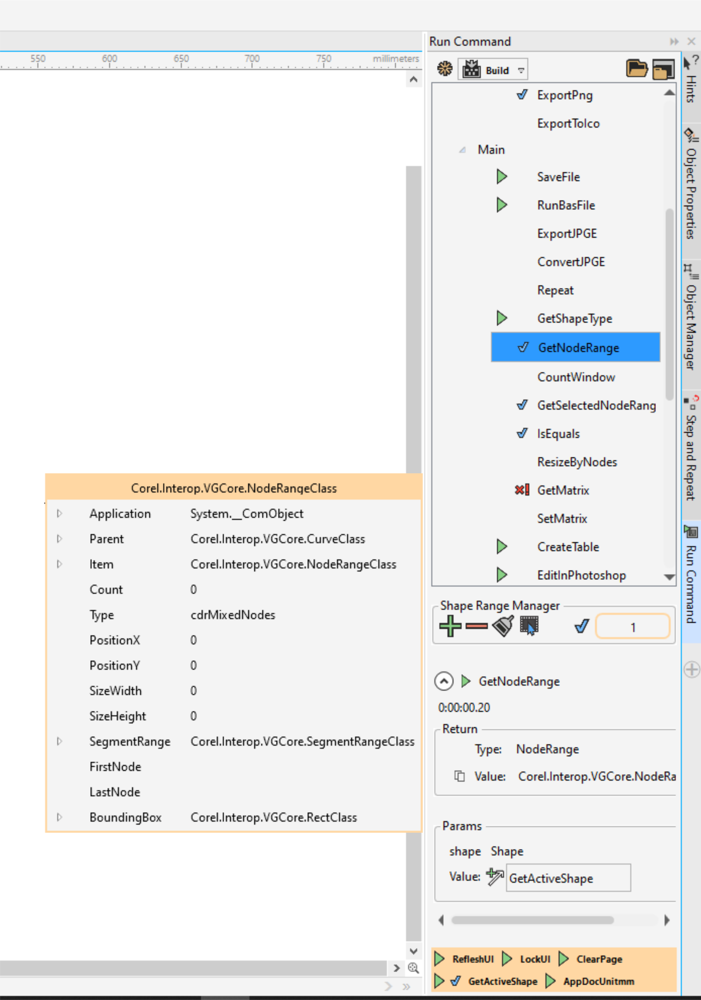

# Bonus630DevToolsBar!

This repository provides you with a comprehensive codebase for creating an addon for CorelDRAW. The solution, built using Visual Studio, compiles into a powerful addon that incorporates a set of tools to enhance your CorelDRAW experience.

Whether you're an experienced developer or just starting with CorelDRAW addons, this toolkit offers a solid foundation to streamline your workflow and expand the capabilities of the software. With a range of meticulously crafted tools, you'll be equipped to develop innovative addons that boost productivity and unleash your creativity.

## Tools Set:

1.: RunCommandDocker

The RunCommandDocker tool is a Docker-based alternative to the native VSTA editor in CorelDRAW. While the native CorelDRAW editor only allows you to create macros using C#, this tool expands your options by enabling macro creation in VB as well. With this tool, you have the flexibility to use any editor of your choice, freeing you from being limited to a specific version of Visual Studio required by CorelDRAW. You can even edit macros using a simple text editor like Notepad, thanks to the built-in C# and VB project templates. Additionally, the tool incorporates the MSBuild command to compile your DLL, simplifying the development process.

Key Features:

* Docker-based alternative to the CorelDRAW VSTA editor.
* Support for macro creation in both C# and VB languages.
* Flexibility to use any editor, including basic text editors like Notepad.
* Built-in C# and VB project templates for quick start.
* Integration of MSBuild command for easy DLL compilation.
* Customizable folder for DLL storage.
* Ability to create macros with parameters and return values.
* Compatibility for using a macro with return value as a parameter for another macro.
* Simple object inspector for exploring methods and properties of .NET and VGCore objects.

The RunCommandDocker tool offers an enhanced development experience for CorelDRAW macros. It allows you to work with both C# and VB languages, use your preferred editor, and compile your macros into DLLs using the MSBuild command. You can specify a specific folder to store the DLLs and take advantage of macros with parameters and return values, as well as leverage macros as parameters in other macros.

2.: DrawUIExplorer

The DrawUIExplorer tool provides an intuitive interface for opening and exploring the drawui.xml file of CorelDRAW or a workspace file in a tree-like structure. This tool comes with a powerful search system, branching capabilities, XSLT testing, icon extraction, item highlighting, opening dockers and dialogs, and running data sources. It serves as an assistant in creating your AppUI and UserUI files.

Key Features:

* Open and explore drawui.xml and workspace files.
* Tree-like structure for easy navigation.
* Comprehensive search functionality.
* Branching capabilities for organizing and managing elements.
* XSLT testing to validate transformations.
* Icon extraction feature for extracting icons from the file.
* Item highlighting for improved visibility.
* Open dockers and dialogs directly from the tool.
* Run data sources for testing and verification.

The DrawUIExplorer tool simplifies the process of working with drawui.xml and workspace files in CorelDRAW. It allows you to navigate and search through the file structure effortlessly, organize elements with branching, and validate XSLT transformations. You can extract icons, highlight specific items for better visibility, and directly access dockers and dialogs from within the tool. Additionally, you can run data sources to test and verify their functionality.

Utilize the core functionality of the DrawUIExplorer tool to perform searches within your projects, enabling efficient navigation and locating specific elements. This feature further enhances your productivity and streamlines the development process.

3.: Shortcuts Docker

The Shortcuts Docker is a powerful tool that generates a comprehensive list of shortcuts present in the DrawUI.xml file. It utilizes the core functionality of the DrawUIExplorer tool to provide an intuitive interface for viewing and managing shortcuts. In addition to visualizing the shortcuts, this docker allows you to execute commands directly from within the tool.

Key Features:

* Generate a list of shortcuts from the DrawUI.xml file.
* Utilizes the core functionality of the DrawUIExplorer tool.
* Intuitive interface for easy navigation and management.
* View shortcuts in a user-friendly format.
* Execute commands directly from the docker.

4.: GMS Dragger

The GMS Dragger is a powerful utility designed to simplify the process of managing and organizing GMS (CorelDRAW script) files. With this tool, you can conveniently drag and drop your GMS files onto the tool's icon or click to select them. The tool provides several useful functionalities to enhance your GMS management experience.

Key Features:

* Drag-and-drop functionality for easy GMS file handling.
* Copy GMS files to the CorelDRAW GMS folder for seamless integration.
* Automatically load the copied GMS files into CorelDRAW.
* Remove the DPB code from the loaded GMS files.
* Quick access to unload all GMS files and remove them from the CorelDRAW GMS folder.

The GMS Dragger tool simplifies the process of adding GMS files to CorelDRAW. By dragging and dropping your GMS files onto the tool's icon or clicking to select them, you can easily copy the files to the CorelDRAW GMS folder. The copied GMS files will be automatically loaded into CorelDRAW, ensuring seamless integration with the software. Additionally, the tool removes the DPB (DataPump Binary) code from the loaded GMS files, optimizing their performance and compatibility.

The GMS Dragger also provides a convenient option to unload all the loaded GMS files from CorelDRAW and remove them from the CorelDRAW GMS folder. This feature allows for quick cleanup and organization of your GMS files.

To use the GMS Dragger, simply drag and drop your GMS files onto the tool's icon or click to select them. The tool will handle the copying, loading, and removal processes automatically. Refer to the documentation provided in this repository for detailed instructions on installation, usage guidelines, and examples.

5 .: CQLEvaluator

The CQLEvaluator is a valuable tool that allows you to validate your expressions written in CQL (Corel Query Language). With this tool, you can easily verify the correctness and accuracy of your CQL expressions, ensuring they meet your intended criteria.

Key Features:

* Expression validation for CQL (Corel Query Language).
* Easy input of CQL expressions for evaluation.
* Quick feedback on the validity of the expressions.

The CQLEvaluator simplifies the process of validating CQL expressions, enabling you to catch errors or identify incorrect usage early on. By inputting your CQL expressions into the tool, you can promptly receive feedback on their validity. The tool identifies syntax errors or incorrect usage, helping you refine your expressions and ensure they accurately reflect your intended criteria.

To use the CQLEvaluator, simply input your CQL expressions into the tool and initiate the evaluation process. The tool will swiftly analyze the expressions and provide feedback on their validity. Refer to the documentation provided in this repository for detailed instructions on installation, usage guidelines, and examples.

7.: Recent Files Box

The Recent Files Box is a handy tool that allows you to store your recent files for quick access. With this tool, you can conveniently save and organize your recent files, enabling easy retrieval and the option to automatically load them upon CorelDRAW startup.

Key Features:

* Store and organize your recent files in a dedicated box.
* Quick access to your recent files for efficient workflow.
* Option to automatically load recent files on CorelDRAW startup.
* Customizable settings for managing file storage and loading behavior.
* Utilize the power of SQLite for efficient data storage and retrieval.
...
Feel free to explore the individual toolsets provided in this repository. Each toolset offers a unique set of functionalities, carefully designed to cater to different aspects of CorelDRAW addon development. The comprehensive documentation included will guide you through the setup process, usage instructions, and customization options for each toolset.

Get started today and take your CorelDRAW addons to the next level with the CorelDRAW Addon Toolkit!

Contributions and feedback are always welcome. If you encounter any issues or have suggestions for improvement, please open an issue or submit a pull request.

Note: This repository is actively maintained and updated to ensure compatibility with the latest versions of CorelDRAW and Visual Studio.

We hope you find this repository helpful and enjoy building incredible addons for CorelDRAW
